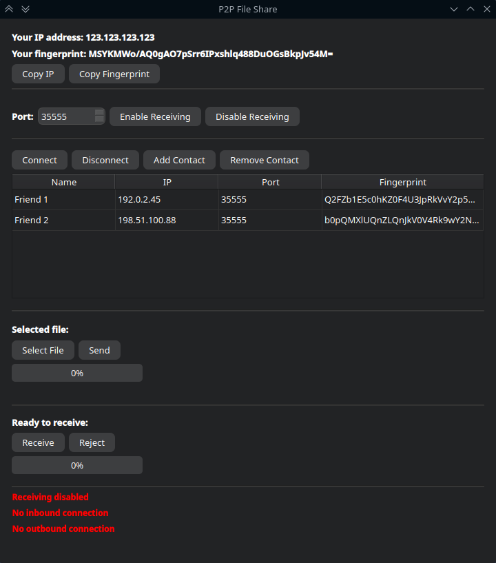

**Receiving files requires a public IP address. It will not work if you are behind CG-NAT. However, you can still
send files without a public IP address.**

---

- All files are sent encrypted over a TLS connection. Note that certificate verification is currently not implemented.

- Ports need to be opened on your network to allow file receiving.
  If UPnP is enabled on your network, the program will automatically open and close the ports of your choosing.
  Otherwise, you will have to manually open ports if you want to receive files.
  No ports need to be opened in order to send files.

- To receive files, click the "Enable Receiving" button. Then, when a file is sent to you, you can choose to either receive or reject it.
  Received files are placed in your "Downloads" folder.

- To connect to someone, use the format "IP address:Port" (e.g., 123.123.123.123:35555).
  Then you can select a file and click the "Send" button to send it.
  You will be notified if the recipient rejects the file, or if it has been downloaded.

- To send folders, package them first (e.g., ZIP), then send them as a regular file.

---

If you want to build an executable: `pyinstaller main.spec`

### **Image of program:**

