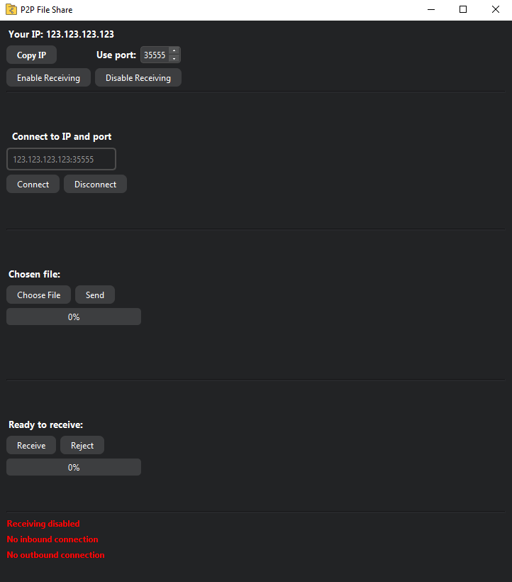

**Receiving files requires a public IP-address. It will not work if you are behind CG-NAT. However, you can still
send files without a public IP-address.**

All files are sent encrypted. A hybrid encryption approach is used. For exchanging keys, sending metadata, and verifying
signatures, RSA-2048 is used. For the actual file encryption AES-128 is used. This ensures both safety and speed.

Ports need to be opened on your network to allow file receiving.
If UPNP is enabled on your network the program will automatically open and close the ports of your choosing.
Otherwise, you will have to manually open ports if you want to receive files.
No ports need to be opened in order to send files.

To receive files you click the "enable receiving" button. Then when a file is sent to you,
you can choose to either receive the file, or reject it.
Received files are placed in your "Downloads" folder.

To connect to someone you use the format "IP-address:Port", e.g. "123.123.123.123:35555".
Then you can choose a file and click the send button to send it.
You will be notified if the recipient rejects the file, or if it has been downloaded.

To send folders you ZIP them first, then send them as a normal file.

**Image of program:**

